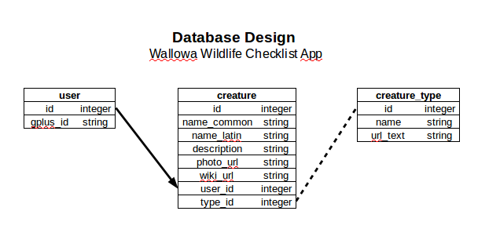

# Wallowa Wildlife Checklist App

This app uses the Python-based microframework Flask and an SQLite3 database to allow users to log in and maintain wildlife checklists for Wallowa County. The database model supports users, checklists, types of creatures, and the creatures themselves. The Flask app builds the database from a .csv file so it is adaptable to any other location, real or imagined. 

The app is architected as an application factory using blueprints and test coverage. It was developed using the [Flaskr tutorial](http://flask.pocoo.org/docs/1.0/tutorial/) as a guide to these new features in Flask.

## Install

Clone the git repository.

```
https://github.com/wicker/Wallowa-Wildlife-Checklist-App.git
```

Create the Python [virtual environment](https://virtualenvwrapper.readthedocs.io/en/latest/).

```
mkvirtualenv wallowa
workon wallowa
```

Install the app.

```
pip install -e .
```

## Run

```
export FLASK_APP=wallowawildlife
export FLASK_ENV=development
flask initdb
flask run
```

Open [http://localhost:5000/](http://localhost:5000/) in a browser. 

Flask may suggest opening `127.0.0.1:5000` but that will cause problems with the Google authentication, so it's best to use the localhost-based link above. 

## Test

```
pip install '.[test]'
pytest
```

Run with a coverage report.

```
coverage run -m pytest
coverage report
coverage html  # open htmlcov/index.html in a browser
```

# Screenshots


# Docs and Design Notes

## Database Schema



## Populating the Database

The `creature_type` table is manually populated by `flask initdb`.

|id|name|url_text|
|--|----|--------|
|1|Mammal|mammal|
|2|Bird|bird|
|3|Reptile/Amphibian|reptile_amphibian|
|4|Tree/Shrub|tree_shrub|
|5|Fish|fish|
|6|Wildflower|wildflower|
|7|Spider/Insect|spider_insect|

The `creature` table is populated by a CSV file called db.csv. The program expects it will take this format: 

|Fields|Example|
|------|-------|
|Common Name|Calcedon Checkerspot|
|Latin Name|Euphydryas chalcedona|
|Type|spider_insect|
|Description|Butterfly found throughout western North America.|
|Photo URL|https://github.com/wicker/Wallowa-Wildlife-Checklist-App-New/blob/master/wallowawildlife/static/img/iwe.png?raw=true|
|Photo Attribution|Jenner Hanni CC-BY-SA 2.0|
|Wiki URL|https://en.wikipedia.org/wiki/Variable_checkerspot|

The `Type` entry must match one of the `url_text` entries in the `creature_type` table above.

All creatures initialized by the db are owned by the admin user with id `1` and may not be edited or deleted by non-admin users.

The `user` table is set up to store hashed Google Plus IDs. 

## Blueprints, Routes, and Templates

|Blueprint|Route|Route Handler|Template|
|---------|-----|-------------|--------|
||/|index()|front_page.html|
|Auth|/register|register()|auth/register.html|
|Auth|/login|login()|auth/login.html|
|Auth|/logout|logout()||
|Lists|/wildlife|listAll()|lists/list.html|
|Lists|/wildlife/mammals|listByType()|lists/list.html|
|Lists|/wildlife/add|addCreature()|lists/creature_add.html|
|Lists|/wildlife/mammals/10|showCreature()|lists/creature_show.html|
|Lists|/wildlife/mammals/10/edit|editCreature()|lists/creature_edit.html|
|Lists|/wildlife/mammals/10/delete|deleteCreature()|lists/creature_delete.html|

